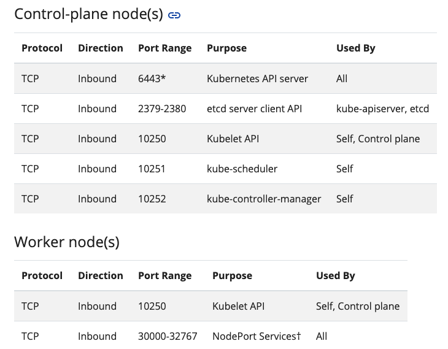

#  Kubernetes Deployment


To deploy your Kubernetes cluster you need a cluster of Linux VM. We recommend to use Punchbox to easily bootstrap a VM cluster.

With punchbox you just need to configured a json file with your requirements RAM, CPU or an use sample ready-to-use. Punchbox will automatically build a VM cluster based on this requirement.

So the first step is to create a config file or use a sample already provided.
If you don't know how to use punchbox please read this [readme](../README.md).

## Generate VM Cluster with Punchbox

### 1. Create a ssh key without password

If you don't have a ssh key on the laptop that will be use to deploy your cluster, you can generate a ssh key with following command.

```ssh
ssh-keygen
```
if you have create a ssh key pair with a custom name, you need to update the the file ``vagrant/Vagrantfile.j2``

```jinja
PUBLIC_KEY = File.read("#{Dir.home}/.ssh/<your_ssh_key>.pub")
```

### 2. Activate punchbox pyenv

 ```sh
pyenv activate punchbox
```

> Pyenv punchbox contains ansible commandes

### 3. Activate punchbox commandes

 ```sh
source activate.sh
```


### 4. Generate Bare Linux Servers
```sh
punchbox --config configurations/empty_16G.json
 --generate-vagrantfile \
 --start-vagrant
```


### 5. Testing connection to your cluster

```sh
ssh vagrant@server1
```

if your a custom ssh key :

```sh
ssh vagrant@server1 -i path/to/your/ssh/key
```

> We recommend to test connection to all servers.


##  Deploy Kubernetes with KAST

KAST (Kubernetes Analytics Stack) is a Thales private project that allow you to bootstrap a Kubernetes cluster on cloud or on premise based on kubeadm tool.
For more informations you can check the [Gitlab repository](https://gitlab.thalesdigital.io/sixdt/kast).
To following this tutorial you need to clone the project KAST and move on the folder KAST.

Before deploy a Kubernetes cluster please check Kubernetes [prerequisites](https://kubernetes.io/docs/setup/production-environment/tools/kubeadm/create-cluster-kubeadm/).

### Prequisites

-   One or more machines running a deb/rpm-compatible Linux OS; for example: Ubuntu or CentOS.
-   2 GiB or more of RAM per machine--any less leaves little room for your apps.
-   At least 2 CPUs on the machine that you use as a control-plane node.
-   Full network connectivity among all machines in the cluster. You can use either a public or a private network.

### Kubernetes Ports




### 1. Create a Ansible hosts file

 ```sh
touch hosts
vim hosts
```

If your nodes have multiple network interfaces you need to specify the advertise address for this particular control-plane node's API server, you can do this with the argument ``ìnternal_address``

example  :

```ini
[kube_master]
server1 internal_address=172.28.128.21

[kube_worker]
server2
server3
```


### 2. Bootstrap your kubernetes cluster

To bootstrap your Kubernetes cluster you need to run 3 ansible role :

 - `preflight.yml` : it will apply some basic nodes configuration
 - `containerd_runtime_install.yml` : This role will basically run accross all worker and master nodes and setup a container runtime for kubernetes
 - `kube.yml` : it will install Kubernetes composant

You can choose Kubernetes composants like Pod network add-on by modify the file ``role/kube/boot/default/main.yml``.
If your nodes have multiple network interfaces you need update the field `nic` with your network interface name in the yaml file ``role/kube/boot/default/main.yml``.
If you have used punchbox you need to set `nic` field with following value

```yaml
nic: enp0s8
```

#### Run role preflight 
```sh
ansible-playbook -i hosts preflight.yml -u vagrant
```
If your use a custom ssh key pair : 
```sh
ansible-playbook -i hosts preflight.yml -u vagrant --private-key=path/to/your/ssh/private/key
```

#### Run role containerd_runtime_install 
```sh
ansible-playbook -i hosts containerd_runtime_install.yml -u vagrant
```
If your use a custom ssh key pair : 
```sh
ansible-playbook -i hosts containerd_runtime_install.yml -u vagrant --private-key=path/to/your/ssh/private/key
```

#### Run role kube 
```sh
ansible-playbook -i hosts kube.yml -u vagrant
```
If your use a custom ssh key pair : 
```sh
ansible-playbook -i hosts kube.yml -u vagrant --private-key=path/to/your/ssh/private/key
```


### 3. Test your Kubernetes cluster

#### Connect  to one master node

```sh
ssh vagrant@server1
```

And run following commands : 

```sh
mkdir -p $HOME/.kube
sudo cp -i /etc/kubernetes/admin.conf $HOME/.kube/config
sudo chown $(id -u):$(id -g) $HOME/.kube/config
export KUBECONFIG=$HOME/.kube/config
```

#### Run kubectl command

```sh
kubectl get pods --all-namespaces -o wide
```

#### Expected result


### 4. Run Kubernetes from your laptop

if you want to run kubectl command directly from you laptop, you need to install kubectl and run following commands :


#### Install kubectl
```sh
curl -LO https://storage.googleapis.com/kubernetes-release/release/$(curl -s https://storage.googleapis.com/kubernetes-release/release/stable.txt)/bin/linux/amd64/kubectl
chmod +x ./kubectl
sudo mv ./kubectl /usr/local/bin/kubectl
```

#### Retrieve kubeconf file from a master node
```sh
scp vagrant@server1:/home/vagrant/.kube/config $HOME/.kube/config
export KUBECONFIG=$HOME/.kube/config
```

If your use a custom ssh key pair : 

```sh
scp -i /path/to/your/private/key vagrant@server1:/home/vagrant/.kube/config  $HOME/.kube/config
export KUBECONFIG=$HOME/.kube/config
```

